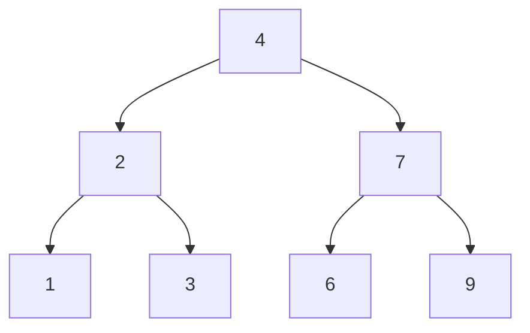
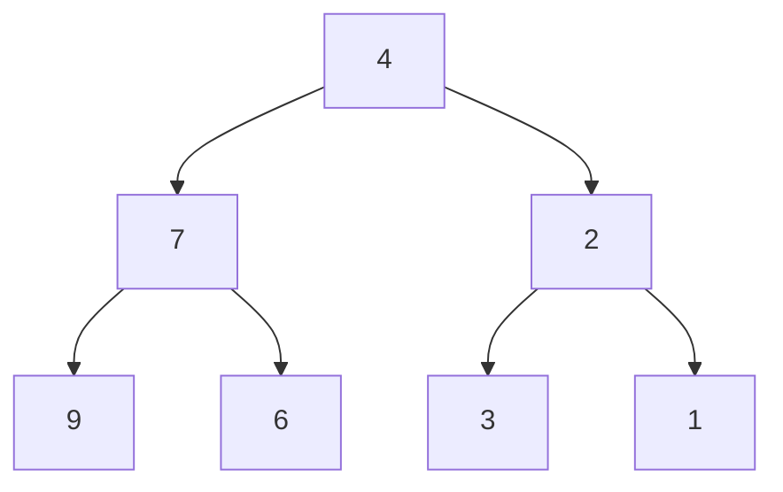
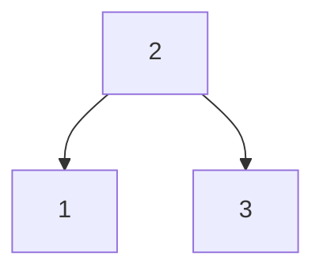
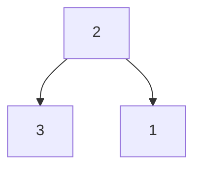

- Difficulty : `Easy`
- Topics : `Tree`, `Depth-First Search`, `Breadth-First Search`, `Binary Tree`

## Problem

Given the `root` of a binary tree, invert the tree, and return its root.

## Example 1:

> **Input:** root = [4, 2, 7, 1, 3, 6, 9]  
> **Output:** [4, 7, 2, 9, 6, 3, 1]

### Input



### Output



## Example 2:

> **Input:** root = [2, 1, 3]  
> **Output:** [2, 3, 1]

### Input



### Output



## Example 3:

> **Input:** root = []  
> **Output:** []

## Constraints

- The number of nodes in the tree is in the range [0, 100].
- -100 <= Node.val <= 100

## Solution

<details>
<summary>클릭하여 펼치기</summary>
<div markdown="1">
```java
class Solution {
    public TreeNode invertTree(TreeNode root) {
        if(root != null) {
            TreeNode temp = root.left;
            root.left = invertTree(root.right);
            root.right = invertTree(temp);
        }
        return root;
    }
}
```
</div>
</details>

## 접근방법

1. 재귀적으로 트리의 각 노드를 방문합니다.
2. 각 노드의 왼쪽 자식과 오른쪽 자식을 교환합니다.
3. 모든 노드에 대해 이 과정을 반복합니다.

#### 출처(참고)

[LeetCode](https://leetcode.com/problems/invert-binary-tree/description/){:target="\_blank"}
