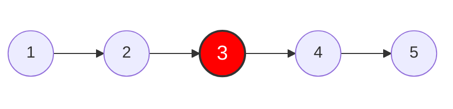
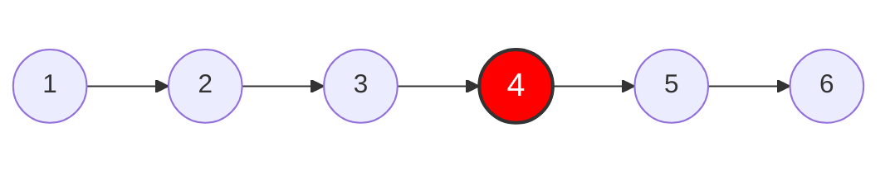

- Difficulty : `Easy`
- Topics : `Linked List`, `Two Pointers`

## Problem

Given the `head` of a singly linked list, return the middle node of the linked list.

If there are two middle nodes, return **the second middle node**.

## Example 1:



> **Input:** head = [1,2,3,4,5]     
> **Output:** [3,4,5]  
> **Explanation:** The middle node of the list is node 3.    


## Example 2:



> **Input:** head = [1,2,3,4,5,6]    
> **Output:** [4,5,6]    
> **Explanation:** Since the list has two middle nodes with values 3 and 4, we return the second one.


## Constraints

- The number of nodes in the list is in the range [1, 100].
- 1 <= Node.val <= 100
- Definition for singly-linked list
```java
public class ListNode {
    int val;
    ListNode next;
    ListNode() {}
    ListNode(int val) { this.val = val; }
    ListNode(int val, ListNode next) { this.val = val; this.next = next; }
}
```

## Solution 1

<details>
<summary>클릭하여 펼치기</summary>
<div markdown="1">
```java
class Solution {
    public ListNode middleNode(ListNode head) {
        ListNode[] nodes = new ListNode[100];
        int t = 0;
        while (head != null) {
            nodes[t++] = head;
            head = head.next;
        }
        return nodes[t / 2];
    }
}
```
</div>
</details>

| Language | Runtime | Memory |
| --- | --- | --- |
| Java | 0 ms | 41.7 MB |

### Approch 1

1. ListNode 배열을 생성하여 next 노드가 없을 때까지 반복합니다.
2. 배열의 중간 포지션 값을 반환합니다.

## Solution 2

<details>
<summary>클릭하여 펼치기</summary>
<div markdown="1">
```java
class Solution {
    public ListNode middleNode(ListNode head) {
        ListNode slow = head, fast = head;
        while (fast != null && fast.next != null) {
            slow = slow.next;
            fast = fast.next.next;
        }
        return slow;
    }
}
```
</div>
</details>

| Language | Runtime | Memory |
| --- | --- | --- |
| Java | 0 ms | 41.49 MB |


### Approch 2

1. 한 단계씩 탐색하는 slow pointer와 두 단계씩 탐색하는 fast pointer를 활용합니다.
2. fast pointer가 탐색을 종료하면, slow pointer를 반환합니다.


#### 출처(참고)

- [LeetCode](https://leetcode.com/problems/middle-of-the-linked-list/){:target="\_blank"}
- [Mermaid-Flowchart-with some styling](https://mermaid.js.org/syntax/examples.html#larger-flowchart-with-some-styling){:target="\_blank"}
