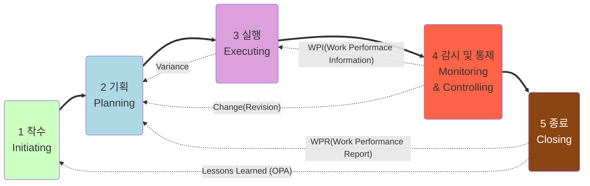

## 프로세스 그룹(Process Group)

## 지식 영역(Knowledge)과 프로세스(Process)

- 모든 프로세스는 투입물(Input), 도구 및 기법(Tool & Technique), 산출물(Output)로 구성된다.

<table style="text-align:center; font-weight:bold; font-size:10pt;">
    <tbody>
        <tr>
            <th style="padding:3px;background-color:rgba(9, 36, 156, 0.75); color:white;">1 통합 관리 Integration  Management</th>
            <td style="padding:3px;background-color:rgb(205, 255, 193);">프로젝트  헌장수립 Develop  Project  Charter</td>
            <td style="padding:3px;background-color:rgb(173, 216, 230);">프로젝트  관리계획서 개발 Develop  Project  Management  Plan</td>
            <td style="padding:3px;background-color:rgb(221, 160, 221);">프로젝트  작업지시  및 관리 Direct  and  Manage  Project  Work</td>
            <td style="padding:3px;background-color:rgb(221, 160, 221);">프로젝트  지식관리 Manage  Project  Knowledge</td>
            <td style="padding:3px;background-color:rgb(255, 99, 71);">프로젝트  작업감시 및 통제 Monitor  and  Control  Project  Work</td>
            <td style="padding:3px;background-color:rgb(255, 99, 71);">통합변경  통제수행 Perform  Integrated  Change  Control</td>
            <td style="padding:3px;background-color:rgb(139, 69, 19);color:white;">프로젝트  또는  단계 종료 Close  Project  or  Phase</td>            
        </tr>
        <tr>
            <th style="padding:3px;background-color:rgba(9, 36, 156, 0.75); color:white;">2 범위 관리 Scope  Management</th>            
            <td style="padding:3px;background-color:rgb(173, 216, 230);">범위관리  계획수립 Plan  Scope  Management</td>
            <td style="padding:3px;background-color:rgb(173, 216, 230);">요구사항  수집 Collect  Requirements</td>
            <td style="padding:3px;background-color:rgb(173, 216, 230);">범위정의 Define  Scope</td>
            <td style="padding:3px;background-color:rgb(173, 216, 230);">WBS 작성 Create  WBS</td>
            <td style="padding:3px;background-color:rgb(255, 99, 71);">범위 확인 Validate  Scope</td>
            <td style="padding:3px;background-color:rgb(255, 99, 71);">범위 통제 Control  Scope</td>
            <td></td>
        </tr>
        <tr>
            <th style="padding:3px;background-color:rgba(9, 36, 156, 0.75); color:white;">3 일정 관리 Schedule  Management</th>            
            <td style="padding:3px;background-color:rgb(173, 216, 230);">일정 관리  계획수립 Plan  Schedule  Management</td>
            <td style="padding:3px;background-color:rgb(173, 216, 230);">활동 정의 Define  Activities</td>
            <td style="padding:3px;background-color:rgb(173, 216, 230);">활동 순서  배열 Sequence  Activities</td>            
            <td style="padding:3px;background-color:rgb(173, 216, 230);">활동 기간  산정 Estimate  Activity  Durations</td>
            <td style="padding:3px;background-color:rgb(173, 216, 230);">일정 개발 Develop  Schedule</td>
            <td style="padding:3px;background-color:rgb(255, 99, 71);">일정 통제 Control  Schedule</td>
            <td></td>
        </tr>
        <tr>
            <th style="padding:3px;background-color:rgba(9, 36, 156, 0.75); color:white;">4 원가 관리 Cost  Management</th>            
            <td style="padding:3px;background-color:rgb(173, 216, 230);">원가 관리  계획수립 Plan  Cost  Management</td>
            <td style="padding:3px;background-color:rgb(173, 216, 230);">원가 산정 Estimate  Costs</td>
            <td style="padding:3px;background-color:rgb(173, 216, 230);">예산 책정 Determine  Budget</td>
            <td style="padding:3px;background-color:rgb(255, 99, 71);">원가 통제 Control  Costs</td>
            <td></td>
            <td></td>
            <td></td>
        </tr>
        <tr>
            <th style="padding:3px;background-color:rgba(9, 36, 156, 0.75); color:white;">5 품질 관리 Quality  Management</th>            
            <td style="padding:3px;background-color:rgb(173, 216, 230);">품질 관리  계획수립 Plan  Quality  Management</td>
            <td style="padding:3px;background-color:rgb(221, 160, 221);">품질 수행 Manage  Quality</td>
            <td style="padding:3px;background-color:rgb(255, 99, 71);">품질 통제 Control  Quality</td>
            <td></td>
            <td></td>
            <td></td>
            <td></td>
        </tr>
        <tr>
            <th style="padding:3px;background-color:rgba(9, 36, 156, 0.75); color:white;">6 자원 관리 Resource  Management</th>            
            <td style="padding:3px;background-color:rgb(173, 216, 230);">자원 관리  계획수립 Plan  Resource  Management</td>
            <td style="padding:3px;background-color:rgb(173, 216, 230);">활동 자원  산정 Estimate  Activity  Resources</td>
            <td style="padding:3px;background-color:rgb(221, 160, 221);">자원 확보 Acquire  Resources</td>
            <td style="padding:3px;background-color:rgb(221, 160, 221);">팀 개발 Develop  Team</td>
            <td style="padding:3px;background-color:rgb(221, 160, 221);">팀 관리 Manage  Team</td>
            <td style="padding:3px;background-color:rgb(255, 99, 71);">자원 통제 Control  Resources</td>
            <td></td>
        </tr>
        <tr>
            <th style="padding:3px;background-color:rgba(9, 36, 156, 0.75); color:white;">7 의사소통 관리 Communications  Management</th>            
            <td style="padding:3px;background-color:rgb(173, 216, 230);">의사소통 관리  계획수립 Plan  Communications  Management</td>
            <td style="padding:3px;background-color:rgb(221, 160, 221);">의사소통 관리 Manage  Communications</td>
            <td style="padding:3px;background-color:rgb(255, 99, 71);">의사소통 감시 Monitor  Communications</td>
            <td></td>
            <td></td>
            <td></td>
            <td></td>
        </tr>
        <tr>
            <th style="padding:3px;background-color:rgba(9, 36, 156, 0.75); color:white;">8 리스크 관리 Risk  Management</th>            
            <td style="padding:3px;background-color:rgb(173, 216, 230);">리스크 관리  계획수립 Plan  Risk  Management</td>
            <td style="padding:3px;background-color:rgb(173, 216, 230);">리스크 식별 (Identify  Risks)</td>
            <td style="padding:3px;background-color:rgb(173, 216, 230);">정성적  리스크 분석 Perform  Qualitative  Risk  Analysis</td>
            <td style="padding:3px;background-color:rgb(173, 216, 230);">정량적  리스크 분석 Perform  Quantitative  Risk  Analysis</td>
            <td style="padding:3px;background-color:rgb(173, 216, 230);">리스크  대응 계획 수립 Plan  Risk  Responses</td>
            <td style="padding:3px;background-color:rgb(221, 160, 221);">리스크  대응 실행 Implement  Risk  Responses</td>
            <td style="padding:3px;background-color:rgb(255, 99, 71);">리스크 감시 Monitor  Risks</td>            
        </tr>
        <tr>
            <th style="padding:3px;background-color:rgba(9, 36, 156, 0.75); color:white;">9 조달 관리 Procurement  Management</th>            
            <td style="padding:3px;background-color:rgb(173, 216, 230);">조달 관리  계획수립 Plan  Procurement  Management</td>
            <td style="padding:3px;background-color:rgb(221, 160, 221);">조달 수행 Conduct  Procurements</td>
            <td style="padding:3px;background-color:rgb(255, 99, 71);">조달 통제 Control  Procurements</td>
            <td></td>
            <td></td>
            <td></td>
            <td></td>
        </tr>
        <tr>
            <th style="padding:3px;background-color:rgba(9, 36, 156, 0.75); color:white;">10 이해관계자 관리 Stakeholder Management</th>
            <td style="padding:3px;background-color:rgb(205, 255, 193);">이해관계자  식별 Identify Stakeholders</td>
            <td style="padding:3px;background-color:rgb(173, 216, 230);">이해관계자  참여  계획수립 Plan Stakeholder Engagement</td>
            <td style="padding:3px;background-color:rgb(221, 160, 221);">이해관계자  참여 관리 Manage Stakeholder  Engagement</td>
            <td style="padding:3px;background-color:rgb(255, 99, 71);">이해관계자  참여 감시 Monitor  Stakeholder  Engagement</td>
            <td></td>
            <td></td>
            <td></td>
        </tr>
    </tbody>
</table>

#### 출처(참고)

- [Mermaid-Flowchart](https://mermaid.js.org/syntax/flowchart.html){:target="\_blank"}