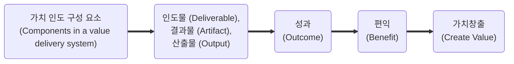

## 1. 가치 인도 시스템 (Value Delivery System)

- 가치 인도 시스템은 프로젝트를 통해 조직의 전략적 목표를 달성하고, 이해관계자에게 가치를 제공하는 것을 목표로 합니다. 

### 1.1. 가치 창출 (Creating Value)
- 프로젝트(projects), 프로그램(programs), 포트폴리오(portfolios), 제품(products) 관리와 거버넌스를 포함하여 조직의 모든 수준에서 가치를 창출하고 전달하는 데 중점을 둡니다.
- 가치 인도 시스템은 정보와 피드백이 모든 구성 요소 간에 일관되게 공유될 때 가장 효과적으로 작동합니다.

#### 1.1.1. 가치 인도 구성 요소의 가치 창출 과정

### 1.2. 조직 거버넌스 시스템 (Organizational Governance Systems) 
- 조직 거버넌스 시스템은 프로젝트가 조직의 전략적 목표와 일치하도록 보장하는 프레임워크를 제공합니다. 
- 이는 의사 결정 구조, 정책, 절차 및 책임을 포함하여 프로젝트의 방향과 통제를 제공합니다. 

### 1.3. 프로젝트 관련 기능 (Project-related Functions) 
- 프로젝트 관련 기능은 프로젝트의 성공적인 수행을 지원하는 다양한 활동과 역할을 포함합니다. 
- 여기에는 프로젝트 관리, 품질 관리, 위험 관리, 자원 관리 등이 포함됩니다.

### 1.4. 프로젝트 환경 (Project Environment) 
- 프로젝트 환경은 프로젝트가 수행되는 물리적, 사회적, 문화적, 정치적, 경제적 맥락을 의미합니다. 
- 이는 프로젝트의 계획 및 실행에 영향을 미치는 내부 및 외부 요인을 포함합니다. 

#### 1.4.1. 내부 환경
- 프로세스 자산(Process assets), 거버넌스 문서(Governance documentation), 데이터 자산(Data assets), 지식 자산(Knowledge assets), 보안 및 안전(Security and safety), 조직 문화/구조 및 거버넌스(Organizational culture, structure, and governance), 시설 및 자원의 지리적 분포(Geographic distribution of facilities and resources), 인프라(Infrastructure), 정보 기술 소프트웨어(Information technology software), 자원 가용성(Resource availability), 직원 역량(Employee capability) 등

#### 1.4.2. 외부 환경
- 시장 상황(Marketplace conditions), 사회적/문화적 영향 및 이슈(Social and cultural influences and issues), 규제 환경(Regulatory environment), 상용 데이터베이스(Commercial database), 학술 연구(Academic research), 산업 표준(Industry standards), 재무적 고려사항(Financial considerations), 물리적 환경(Physical environment) 등 

### 1.5. 제품 관련 고려 사항 (Product-related Considerations) 
- 제품 관련 고려 사항은 프로젝트를 통해 인도되는 제품이나 서비스의 특성과 요구 사항을 다룹니다. 
- 이는 제품의 품질, 성능, 기능, 지속 가능성 등을 포함하여 고객의 기대를 충족시키는 데 중점을 둡니다. 
  

---
  
  
#### 주요 용어 정리
- **인도물(Deliverable)**: 프로세스, 단계 또는 프로젝트를 완료하기 위해 산출해야 하는 고유하고 검증 가능한 구체적인 결과물, 제품.
- **결과물(Artifact)**: 프로젝트 과정에서 생성된 문서, 템플릿, 도구, 산출물 또는 프로젝트 인도물
- **산출물(Output)**: 측정 가능한 유/무형의 결과
- **성과(Outcome)**: 프로세스나 프로젝트의 최종 결과물. 프로젝트의 결과로 나타나는 변화나 혜택. 성과에는 산출물과 결과물이 포함될 수 있지만 프로젝트를 통해 인도하려는 편익과 가치에 초점을 맞추면 의미가 더 넓어질 수 있다. 
- **편익(Benefit)**: 재화나 서비스를 소비함으로써 얻을 수 있는 주관적 만족감을 객관적 척도인 화폐가치로 표현한 것. 프로젝트 성과로 인해 이해관계자가 얻는 긍정적인 효과.
- **가치(Value)**: 프로젝트가 이해관계자에게 제공하는 유익이나 중요성. 이해관계자마다 가치를 인식하는 방식이 다르다. 
    - 고객은 제품의 특정 기능 및 특징을 사용할 수 있는 능력으로 가치를 정의할 수 있다. 
    - 조직은 재무 지표에 따라 결정된 비즈니스 가치에 중점을 둘 수 있다.
    - 사회적 가치에는 사람, 지역사회 또는 환경 그룹에 대한 기여도가 포함될 수 있다.
- **이해관계자(Stakeholder)**: 프로젝트, 프로그램 또는 포트폴리오의 의사결정, 활동 또는 결과로 인해 영향을 받거나 받을 수 있거나 스스로 영향을 받는다고 여기는 개인, 집단, 또는 조직
    - 프로젝트팀/프로젝트 관리팀/프로젝트 관리자 >> 운영위원회/PMO/관리 기관 >> 규제 기관/최종 사용자/고객
- **이해관계자 분석(Stakeholder Analysis)**: 프로젝트 전반에 걸쳐 고려해야 할 이해관계자의 이해관계를 결정하기 위한 정량적 및 정성적 정보를 체계적으로 수집하고 분석하는 방법
- **프로젝트 관리자(Project Manager)**: 프로젝트 목표를 달성할 책임을 지고 프로젝트팀을 이끌도록 수행 조직에 의해 선임된 책임자.
- **프로젝트관리팀(Project Management Team)**: 프로젝트에서 프로젝트관리 활동에 직접 참여하는 구성원
- **프로젝트팀(Project Team)**: 정해진 목표를 달성하기 위해 프로젝트작업을 수행하는 집단

#### 출처(참고)
- [PMI](https://www.pmi.org/){:target="_blank"}

