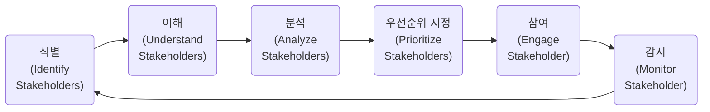

  
## 3. 프로젝트 성과 영역 (Project Performance Domains)

### 3.1. **이해관계자 (Stakeholder)**
- 이해관계자의 요구와 기대를 관리합니다.
- 성과:
    - 프로젝트 전반에 걸쳐 이해관계자와의 생산적인 업무 관계
    - 프로젝트 목표에 대해 이해관계자와 합의
    - 프로젝트 수혜자인 이해관계자가 지지하고 만족하며, 프로젝트나 그 인도물에 반대할 수 있는 이해관계자는 프로젝트 결과에 부정적인 영향을 미치지 않는다.

#### 3.1.1. 효과적인 이해관계자 참여 (Navigating Effective Stakeholder Engagement)

#### 3.1.2. 다른 성과영역과의 상호 작용 (Interactions with Other Performance Domains)
- 이해관계자는 프로젝트의 모든 측면에 영향을 준다.
- 프로젝트팀의 요구사항과 범위를 정의하고 우선순위를 지정한다.
- 함께 참여하여 계획을 수립한다.
- 프로젝트 인도물과 결과에 대한 인수 및 품질 기준을 결정한다.
- 일부 이해관계자는 프로젝트에 존재하는 불확실성을 줄이는 데 도움이 될 수 있지만, 어떤 이해관계자들은 불확실성을 늘릴 수 있다.

#### 3.1.3. 성과물 체크리스트  (Measuring Outcomes)

| 성과 | 체크 |
|---|---|
| 프로젝트 전반에 걸친 이해관계자와의 생산적인  업무 관계 | 이해관계자와의 생산적인 업무 관계를 관찰할 수 있다.  그러나 지속적인 참여에 따른 이해관계자의 움직임은  프로젝트에 대한 상대적 만족도 수준을 나타낼 수 있다. |
| 프로젝트 목표에 대한 이해관계자와의 합의 | 범위 외에도 프로젝트 및 제품 요구사항에 대한 많은 변경이나 수정은  이해관계자가 프로젝트 목표에 관여하지 않거나  조정되지 않았음을 의미할 수 있다. |
| 프로젝트 수혜자인 이해관계자가 지지하고  만족하며, 프로젝트나 그 인도물에 반대할 수 있는 이해관계자는 프로젝트 결과에 부정적인 영향을 미치지 않는다.| 이해관계자 행동은 프로젝트 수혜자가 프로젝트에 만족하고 지지하는지,  또는 반대하는지 여부를 나타낼 수 있다.  또한 설문조사, 인터뷰 및 핵심전문가 그룹도 이해관계자가  프로젝트와 해당 결과물에 만족하고 지지하는지  또는 반대하는지 여부를 결정하는 효과적인 방법이 된다.  프로젝트 이슈 관리대장 및 리스크 관리대장을  검토하면 개별 이해관계자와 관련된 문제를 식별할 수 있다. |
  
  

#### 출처(참고)
- [PMI](https://www.pmi.org/){:target="_blank"}

